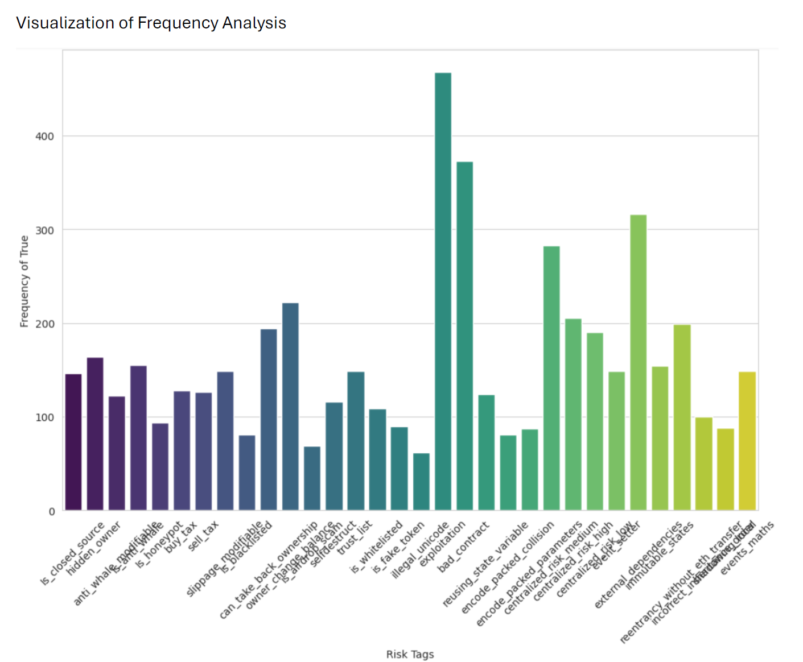
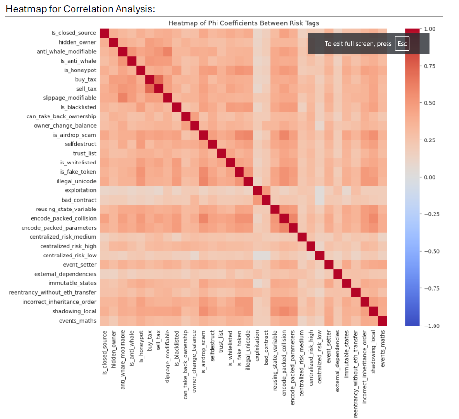

## README for Frequency Analysis and Correlation Analysis Project

### Project Overview

This project involves a detailed analysis of frequency and correlation of various risk tags associated with smart contracts. The analysis is visualized using bar charts and heatmaps to provide clear insights into the data.

### Files in the Repository

1. **compiled_risk_data.xlsx**: This file contains the compiled data of risk tags used for the analysis.
2. **Frequency_analysis_share.ipynb**: A Jupyter Notebook that includes the code for performing the frequency and correlation analysis on the risk tags.
3. **Frequency_Bar.png**: A PNG image that visualizes the frequency of each risk tag.
4. **Heatmap_Correlation_analysis.png**: A PNG image that shows the heatmap of the correlation analysis between different risk tags.
5. **Frequency_Correlation.docx**: A Word document that provides detailed descriptions and interpretations of the frequency and correlation analysis.
6. **Frequency_Correlation.pdf**: A PDF version of the document providing detailed descriptions and interpretations of the analysis.

### Instructions for Reproducing the Analysis

1. **Set Up the Environment**:
    - Ensure you have Python installed on your system.
    - Install the required libraries using the command:
      ```bash
      pip install pandas matplotlib seaborn jupyter
      ```

2. **Load the Data**:
    - Open the Jupyter Notebook `Frequency_analysis_share.ipynb`.
    - Load the `compiled_risk_data.xlsx` file into the notebook to access the data for analysis.

3. **Perform the Analysis**:
    - Run the cells in the notebook to perform the frequency and correlation analysis.
    - The notebook will generate the visualizations included in the repository.

4. **Review the Visualizations**:
    - The `Frequency_Bar.png` image provides a bar chart visualization of the frequency of each risk tag.
    - The `Heatmap_Correlation_analysis.png` image shows the heatmap of the correlation between different risk tags.

5. **Read the Detailed Analysis**:
    - Refer to `Frequency_Correlation.docx` or `Frequency_Correlation.pdf` for a detailed description and interpretation of the analysis.

### Visualizations

- **Frequency Analysis Bar Chart**:
  

- **Correlation Analysis Heatmap**:
  

### Conclusion

This project provides a comprehensive analysis of the frequency and correlation of risk tags associated with smart contracts. The visualizations and detailed descriptions offer valuable insights into the data, helping to understand the relationships and occurrences of various risks.

For any questions or further assistance, please feel free to contact Ishan Haldankar.
